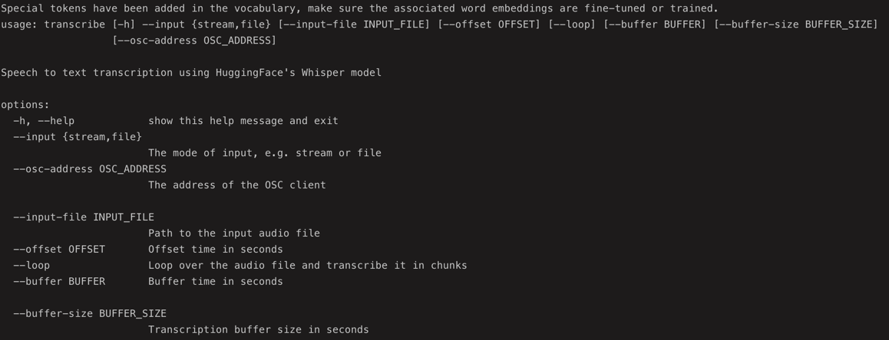

# Welcome to this Project!

Let's get you set up so you can start exploring. It's like putting together a few simple building blocks before making something awesome.

## Mission Control: Installing Python

- Check-Up: First, make sure you have the right version of Python on your computer. It's like making sure you have the right spaceship fuel! To see your version, open up a window called "terminal" or "command prompt" on your computer and type 
    
    ```bash
    python --version 
   ```
   
   Do you see a version starting with 3.11 or higher?

-  Houston, we need Python:  If you need to get Python or change your version, there's a cool tool called "pyenv." It helps you manage different Python versions like switching space suits depending on the mission.  You can find info on getting pyenv on its website (we can even help with that later if you need!).
- You can select the version of Python you want to use by typing the following command in your terminal or command prompt window:

    ```bash
    pyenv install 3.11.0
    pyenv global 3.11.0
    ```
  
- Python is installed and ready to go! 🚀

## Poetry: The Project Organizer

- The Toolkit: Think of Poetry as your handy toolbox for the project. It keeps all your tools organized. You'll need to install it on your computer: 

    ```bash
    pip3 install poetry
    ```

## Let's Build with Poetry

-  Get the Plans: You need to download the project from GitHub. If you're not familiar with GitHub, it's like a giant warehouse for project blueprints. Think of it as instructions for a super-cool LEGO build. Check out GitHub's guides if you need help getting the project! In order to download the project, you can use the following command:

    ```bash
    git clone <project-url>
    ```

-  Build It: Using your "terminal" or "command prompt" window:

  1.  Go to the folder where you downloaded the project by using the `cd` command. For example, if you downloaded the project to your desktop, you'd type `cd Desktop/project-name` and hit Enter. 
  2. Type `poetry install` and hit Enter. (Poetry reads the project's blueprints and grabs all the necessary tools).

## Test Drive!

Does it Fly? Let's make sure everything is working perfectly. 

- In your terminal/command prompt window (while still in the project folder), type: `poetry run transcribe --help` and hit Enter. If everything is set up right, you'll see some messages telling you the project is happy and healthy. The screenshot below shows what you should see:



## Houston, We Have Lift-Off!

You're all set! If you encounter any bumps along the way, don't hesitate to ask for help. We're a friendly bunch in the space program! 😉

Need additional Information or Got Stuck?

    There might be more detailed instructions inside the project itself (look for a file named something like "README" or "instructions").
    Let us know where you got stuck so we can make things even clearer!

Let the adventure begin!
